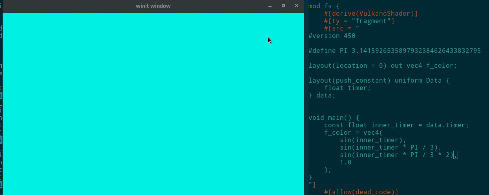

# rust-raytracer-assignment
This will be a raytracer written with Rust and Vulkan

I am doing this as my coding assignment for the computer graphics course and because I want to go deeper into Vulkan and Rust

## Progress

I will update this section with more images

Currently this raytracer looks like this:

