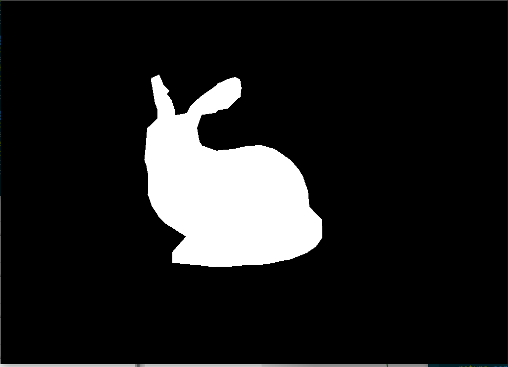
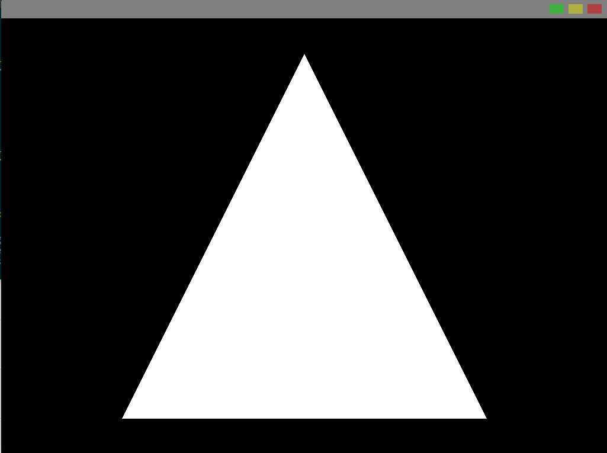

# rust-raytracer-assignment
This will be a raytracer written with Rust and Vulkan

I am doing this as my coding assignment for the computer graphics course and because I want to go deeper into Vulkan and Rust

## Build the binary

You need `cargo` and `rustc` installed, using [rustup](https://rustup.rs/) is the easiest for this.

Then simply run `cargo build` to compile a binary or `cargo run` to build and execute

## Progress

I will update this section with more images

Currently this raytracer looks like this:

### Rendering a more complex model

Older versions (reverse chronological order):

### First triangle rendered ([commit](https://github.com/jvanbruegge/rust-raytracer-assignment/commit/ce0da924b937a9c56d58a42ecc7049c5610bbb9f))

### Changing color based on window width ([commit](https://github.com/jvanbruegge/rust-raytracer-assignment/commit/719b86d65bcd53451fa37ab88d8be538a5ffc4fb))

### Changing color based on time ([commit](https://github.com/jvanbruegge/rust-raytracer-assignment/commit/39906da76704fdbcb40fd087e4172b560fd07ecc))

